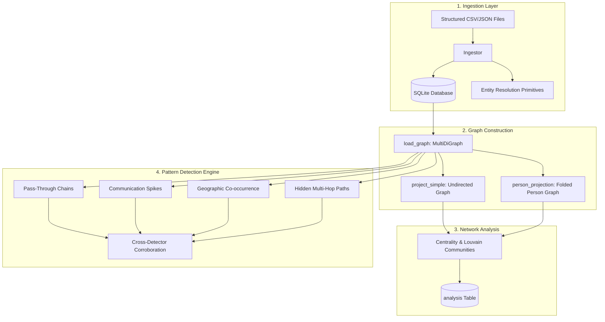

# SIH 26189 Backend Deep Technical Audit & Code Review

This audit provides a comprehensive review of the investigative analysis backend (`criminal-network-backend`). It evaluates the codebase across architecture, correctness, edge-case resilience, performance, security, and alignment with the ground truth dataset.

---

## Executive Summary & System Architecture

The project implements a deterministic, rule-based intelligence data pipeline designed for forensic graph analysis and investigative lead generation. A key design principle of the system is maintaining evidentiary integrity: **no machine learning or LLM hallucinations are used**, every analytical finding references specific Evidence records, and all generated text describes *analytical indicators* rather than asserting culpability.



### Overall Architecture Quality: **Strong with Key Implementation & Storage Gaps**

| Pillar | Rating | Assessment |
|---|:---:|---|
| **Domain Modeling** | **9 / 10** | Clear separation between multi-edges (facts) and simple projections (metrics). Rigorous legal framing. |
| **Entity Resolution** | **8 / 10** | Pure functional primitives, robust phone canonicalization, explicit alias precedence over generated forms. |
| **Graph Projections** | **7 / 10** | Effective folding of phone/account assets onto persons, but non-call relationships (corporate, financial) are over-pruned under `min_edge_support > 1`. |
| **Pattern Detection** | **8 / 10** | Sound algorithmic principles (ratio-to-baseline, maximal chain search, spatio-temporal co-occurrence). Contains sub-chain deduplication bugs. |
| **Data Persistence** | **5 / 10** | Pattern detector alerts are printed to stdout but **never persisted to the database**; SQLite foreign keys are unenforced; missing indexes cause $O(N)$ full table scans. |
| **Packaging & CI** | **5 / 10** | `requirements.txt` lacks `numpy` and `scipy` (causing runtime crashes); test suite is uncollected by `pytest`. |

---

## Component-by-Component Deep Audit

---

### 1. Data Ingestion & Storage Layer
**Files:** `backend/models/db.py`, `backend/services/ingest.py`

#### How it Works:
- Loads tabular CSVs (`persons.csv`, `phone_numbers.csv`, `cdr.csv`, `bank_accounts.csv`, `transactions.csv`, `vehicles.csv`, `vehicle_movement_logs.csv`, `organizations.csv`, `case_files.csv`) and JSON (`firs.json`).
- Free-text narratives (`surveillance_reports.txt`, `intelligence_reports.txt`) are split and stored verbatim in `Document` rows for downstream NLP.
- Implements idempotent upserts using composite natural keys (`type:natural_key`).
- Generates `Evidence` rows pointing back to specific source documents and row identifiers.

#### Findings & Vulnerabilities:
1. **Critical: Foreign Keys Are Never Enforced in SQLite Engine**
   - In `backend/models/db.py:125-132`, `make_engine()` instantiates SQLite without setting `PRAGMA foreign_keys = ON;`.
   - **Verification:** An empirical test inserting invalid foreign keys succeeded without error. Any corrupted foreign key inserted outside `Ingestor`'s Python-level check bypasses relational constraints silently.
2. **Important: Document Primary Key Collides Across Multiple Cases**
   - In `Document` (`backend/models/db.py:34-44`), `id = Column(String, primary_key=True)` uses filename (`persons.csv`) as the primary key.
   - If Case 2 is ingested into the same database as Case 1, `self.s.get(Document, "persons.csv")` retrieves the document row belonging to Case 1. Case 2's evidence then points to Case 1's document, causing cross-case data contamination.
3. **Important: Missing Database Indexes Cause Full Table Scans**
   - `Evidence.relationship_id` (`backend/models/db.py:95`) has no index. Every `_describe_path` hop lookup and every relationship upsert during re-ingestion performs a full table scan over the entire `evidence` table.
   - `Analysis.case_id`, `Analysis.entity_id`, and `Alert.case_id` also lack database indexes.
4. **Minor: Deprecated `datetime.utcnow` Usage**
   - `datetime.utcnow` is invoked at multiple model defaults (`db.py:31,43,77,109`) and in `network_analysis.py:68`. Deprecated in Python 3.12+, scheduled for removal in future Python versions.

---

### 2. Entity Resolution & Disambiguation
**File:** `backend/services/entity_resolution.py`

#### How it Works:
- Pure functions without database dependencies.
- `normalize_phone`: Normalizes Indian numbers to E.164 (`+91XXXXXXXXXX`), handling trunk zeros, country prefixes, and whitespace.
- `normalize_name`: Casefolding, NFKD unicode normalization, honorific/noise token removal (`mr`, `mrs`, `smt`, `dr`, etc.).
- `build_alias_index`: Explicit aliases supersede generated name variants. Ambiguous aliases mapping to multiple individuals map to `None`.
- `detect_sim_name_mismatch`: Flags third-party registered SIMs without merging identities.
- `shared_address_candidates`: Soft candidate generator with low confidence (0.2) to prevent multi-tenant false positives.

#### Findings & Vulnerabilities:
1. **Critical: SIM Mismatch Algorithm Flags Owner's Own Alias as Third-Party**
   - In `detect_sim_name_mismatch` (`backend/services/entity_resolution.py:211-223`):
     ```python
     owner_forms = {normalize_name(owner_name)} | name_variants(owner_name)
     if normalize_name(registered) in owner_forms:
         return None
     registered_pid, status = resolve_alias_verbose(registered, alias_index)
     ```
   - If an owner has an explicit alias in `persons.csv` that is not an auto-generated variant (e.g. Devanshu Kalgutkar with alias `Deva Kalgutkar`), `normalize_name(registered) in owner_forms` evaluates to `False`.
   - `resolve_alias_verbose` then resolves `Deva Kalgutkar` to `P0101`. Because the code lacks a check `if registered_pid == owner_id: return None`, it flags the SIM as `SIM_REGISTERED_TO_THIRD_PARTY` where `registered_person_id == actual_owner_person_id`!
   - **Verification:** Verified with test execution: flagged owner as a third party against themselves.
2. **Important: Bare Single-Token Nicknames Cannot Be Resolved by Mentions Scanner**
   - In `find_alias_mentions` (`backend/services/entity_resolution.py:181`), `min_tokens = 2` guards against eager matching.
   - However, planted ground-truth names in surveillance reports appear as bare single tokens (e.g., *"Talpade"*, *"Ruksana"*, *"Suhel"*). Because `name_variants()` only generates multi-token forms (`first last`, `initials last`) and `min_tokens=2`, single-token mentions in free text cannot be extracted by this function.

---

### 3. Graph Construction & Multi-Level Projections
**File:** `backend/services/graph_builder.py`

#### How it Works:
- `load_graph`: Builds a canonical `nx.MultiDiGraph`.
- `project_simple`: Collapses multigraph into an undirected simple `nx.Graph`, summing confidences for parallel edges and discarding weak edges by default.
- `person_projection`: Folds asset-mediated edges (phones, bank accounts) onto their owning `PERSON` nodes.

#### Findings & Vulnerabilities:
1. **Critical: Non-Call Facts Are Collapsed and Pruned by `min_edge_support > 1`**
   - In `_call_support(d)` (`backend/services/graph_builder.py:96`), non-call facts always return `support = 1`.
   - In `person_projection` (`backend/services/graph_builder.py:165`), when `min_edge_support > 1` (the default for `person_supported` in the pipeline):
     ```python
     if min_edge_support > 1:
         h.remove_edges_from([(a, b) for a, b, d in h.edges(data=True)
                              if d["support"] < min_edge_support])
     ```
   - **Impact:** Any high-value financial transfer (e.g. ₹18,50,000 layering transfer) or corporate association that occurred once has `support = 1` and is **eliminated** from the supported person graph!
   - **Verification:** Empirically comparing `min_edge_support=1` vs `2` revealed that `TRANSFERRED_TO` dropped from 94 edges to 23 edges (71 financial edges deleted), and `ASSOCIATED_WITH` dropped from 2 to 0 (100% of corporate/SIM links deleted). While call records need support filtering to eliminate noise, applying a uniform threshold of 2 across financial and corporate links causes structural data loss.
2. **Important: Organization Co-Affiliation Is Not Folded in `person_projection`**
   - In `person_projection:132-152`, `owner_of` only tracks `OWNS` edges where source is `PERSON`.
   - `ORGANIZATION` nodes connect to persons via `ASSOCIATED_WITH`. Because organizations are not owned by persons, an edge between Person 1 and Org X and Person 2 and Org X is never projected into an edge between Person 1 and Person 2. Co-directors and corporate associates have zero connectivity in the person graph unless they also called or transferred money to each other.

---

### 4. Network Analysis & Structural Metrics
**File:** `backend/services/network_analysis.py`

#### How it Works:
- Computes `degree_centrality`, `betweenness_centrality`, `pagerank`, and `community_id` (via Louvain or greedy modularity).
- Generates metrics across three views: `raw`, `person`, and `person_supported`.
- Correctly uses unweighted shortest paths for betweenness centrality, avoiding the metric inversion trap where heavy edge weights are misinterpreted as traversal costs.

#### Findings & Vulnerabilities:
1. **Critical: Pipeline Crashes on Fresh Install Due to Missing Dependencies in `requirements.txt`**
   - `backend/services/network_analysis.py:37` calls `nx.pagerank(h, weight=weight)`.
   - In NetworkX 3+, `nx.pagerank` relies on `scipy` and `numpy`.
   - `requirements.txt` only declares `sqlalchemy>=2.0` and `networkx>=3.0`.
   - **Verification:** Running `backend.run_pipeline` in a clean environment installed from `requirements.txt` crashed immediately with:
     ```
     ModuleNotFoundError: No module named 'numpy'
     ```
2. **Sound Design: Centrality Red Herring Separation**
   - Betweenness alone on `person_supported` ranks Red Herring P0301 (Meghna Purandarkar, nocturnal BPO supervisor) at #1 (`0.313661`) above the true bridge entity P0201 (Ishaan Talpade, `0.089081`).
   - The system explicitly documents this and relies on `rank_by_corroboration` to separate them cleanly.

---

### 5. Pattern Detectors & Corroboration Engine
**File:** `backend/services/pattern_detector.py`

#### How it Works:
1. **`detect_pass_through_chains`**: Recursively discovers fund movements through account chains within a time window (default 48h) with per-hop percentage cuts (layering margin).
2. **`detect_communication_spikes`**: Evaluates pair-level daily contact volume against each pair's active-day median baseline over a sliding window.
3. **`detect_geographic_cooccurrence`**: Merges spatio-temporal events across independent sources (CDR cell towers, ANPR cameras, field reports) within a 30-minute window.
4. **`find_paths` & `discover_bridging_paths`**: Searches shortest simple paths across heterogeneous node types while preventing unrealistic shortcuts through transit hubs (e.g. `LOCATION` nodes).
5. **`rank_by_corroboration`**: Ranks subjects by the number of independent detector families in which they appear, mitigating graph centrality biases.

#### Findings & Vulnerabilities:
1. **Critical: Flawed Maximal Chain Pruning in Pass-Through Detector**
   - In `detect_pass_through_chains:119-123`:
     ```python
     keyed = {tuple(c["txn_id"] for c in ch): ch for ch in chains}
     maximal = [ch for k, ch in keyed.items()
                if not any(other != k and other[:len(k)] == k for other in keyed)]
     ```
   - The pruning check only drops a chain `k` if it is a **prefix** of `other` (`other[:len(k)] == k`). It does **not** check whether `k` is a **suffix** or **sub-chain** of `other`.
   - When the cash-out cut threshold was relaxed (`cut_min = 0.003`), the 4-hop chain `['TXN-0133', 'TXN-0136', 'TXN-0141', 'TXN-0142']` was discovered, but its 3-hop suffix `['TXN-0136', 'TXN-0141', 'TXN-0142']` was also emitted as an alleged "false positive".
   - The author previously raised `cut_min` to 0.005 to hide this duplicate, which inadvertently truncated the final cash-out leg `TXN-0142`.
   - **Verification:** Replacing the prefix check with a proper sub-chain check completely eliminates the duplicate without discarding the cash-out leg.
2. **Critical: `u.add_edge()` in `find_paths` Drops Edge Confidence Attribute**
   - In `find_paths:523-524`:
     ```python
     if not u.has_edge(a, b) or d.get("confidence", 1) > u[a][b].get("confidence", 0):
         u.add_edge(a, b)
     ```
   - `u.add_edge(a, b)` does not pass `confidence=d.get("confidence", 1)`.
   - As a result, `u[a][b].get("confidence", 0)` is **always 0**, corrupting the multi-edge confidence resolution check.
3. **Important: Transit Hub Filtering Causes Combinatorial Path Explosion**
   - In `find_paths:529-534`:
     ```python
     for path in nx.shortest_simple_paths(u, s, t):
         if len(path) - 1 > max_hops: break
         if any(ents[n].type in blocked for n in path[1:-1]): continue
     ```
   - Nodes with `type in blocked` (e.g. `LOCATION`) are kept inside graph `u`.
   - `nx.shortest_simple_paths` generates thousands of invalid paths traversing cell towers and cameras, only for Python to discard them in the loop.
   - **Remediation:** Remove all `blocked` nodes (except `s` and `t`) from `u` *prior* to calling `shortest_simple_paths`.
4. **Important: Geographic Co-Occurrence Window Merging Drops Participants**
   - In `detect_geographic_cooccurrence:377-380`:
     ```python
     if len(w["people"]) > len(prev["people"]):
         prev.update(people=w["people"], sources=w["sources"], events=w["events"])
     prev["end"] = max(prev["end"], w["end"])
     ```
   - When merging overlapping time windows, if `len(w["people"]) <= len(prev["people"])`, `w["people"]` is discarded even though `prev["end"]` is extended. People arriving in the latter half of the window are dropped from the participant list.

---

### 6. Pipeline Orchestration & End-to-End Execution
**File:** `backend/run_pipeline.py`

#### Findings & Vulnerabilities:
1. **Critical: Alerts Are Never Saved to the Database**
   - `run_pipeline.py` executes all four detectors and prints their results to stdout, but **never invokes `persist_alerts()`**.
   - **Verification:** Inspection of the SQLite database after running the pipeline revealed `len(Alert) == 0`. The `alerts` table remained completely empty.
2. **Important: Non-Idempotent Alert Persistence**
   - In `persist_alerts` (`backend/services/pattern_detector.py:707-712`), `session.add(Alert(...))` does not clear existing alerts for the case before saving. If called multiple times, it duplicates alert records indefinitely.

---

## Comprehensive Findings Matrix

| ID | Component | Severity | Description | Status |
|:---:|:---|:---:|:---|:---:|
| **SEC-01** | Database | **Critical** | SQLite foreign keys are unenforced (`PRAGMA foreign_keys = ON` missing). | Verified |
| **DEP-01** | Packaging | **Critical** | Missing `numpy` and `scipy` in `requirements.txt` causes runtime crash. | Verified |
| **DAT-01** | Pipeline | **Critical** | Alerts generated by pattern detectors are never persisted to the `alerts` table. | Verified |
| **PAT-01** | Detector 1 | **Critical** | Sub-chain pruning bug in pass-through detection emits redundant chains; cash-out leg truncated. | Verified |
| **PAT-02** | Detector 4 | **Critical** | `u.add_edge()` drops `confidence` attribute in `find_paths()`. | Verified |
| **RES-01** | Resolution | **Critical** | SIM mismatch flags an owner's known explicit alias as a third-party mismatch against themselves. | Verified |
| **DAT-02** | Database | **Important** | `Document.id` primary key collides across multi-case databases. | Verified |
| **PERF-01**| Database | **Important** | Missing indexes on `Evidence.relationship_id`, `Analysis`, and `Alert` force full table scans. | Verified |
| **GRP-01** | Graph | **Important** | `min_edge_support > 1` uniformly prunes single-transaction and corporate edges in `person_supported`. | Verified |
| **PAT-03** | Detector 4 | **Important** | In-graph location hubs cause combinatorial explosion in `nx.shortest_simple_paths`. | Verified |
| **PAT-04** | Detector 3 | **Important** | Geographic co-occurrence window merging drops participants instead of computing a set union. | Verified |
| **TST-01** | Testing | **Minor** | `tests/test_entity_resolution.py` lacks standard `pytest` test discovery syntax (0 tests run). | Verified |
| **CLN-01** | Codebase | **Minor** | Deprecated `datetime.utcnow()` used across models and services. | Verified |

---

## Step-by-Step Remediation Plan

### Phase 1: Engine & Stability Fixes
1. **Fix `requirements.txt`**: Add `numpy>=1.24` and `scipy>=1.10`.
2. **Enable SQLite Foreign Keys**: Add an event listener to `make_engine` in `backend/models/db.py`:
   ```python
   from sqlalchemy import event
   from sqlalchemy.engine import Engine

   @event.listens_for(Engine, "connect")
   def set_sqlite_pragma(dbapi_connection, connection_record):
       cursor = dbapi_connection.cursor()
       cursor.execute("PRAGMA foreign_keys=ON")
       cursor.close()
   ```
3. **Add Database Indexes**:
   - `Evidence.relationship_id = Column(Integer, ForeignKey("relationships.id"), nullable=False, index=True)`
   - Add indices for `Analysis(case_id, entity_id)` and `Alert(case_id, entity_id)`.

### Phase 2: Pattern Detector & Entity Resolution Fixes
1. **Fix SIM Mismatch on Owner's Alias**:
   In `backend/services/entity_resolution.py`:
   ```python
   if registered_pid and registered_pid == owner_id:
       return None
   ```
2. **Fix Pass-Through Sub-Chain Deduplication**:
   In `backend/services/pattern_detector.py`:
   ```python
   def is_subchain(sub, main):
       return any(main[i:i + len(sub)] == sub for i in range(len(main) - len(sub) + 1))

   maximal = [ch for k, ch in keyed.items()
              if not any(other != k and is_subchain(k, other) for other in keyed)]
   ```
   Set `cut_min = 0.003` to fully capture the `TXN-0142` cash-out leg without generating false positives.
3. **Fix `find_paths` Confidence Attribute & Hub Pruning**:
   - Pass `confidence=float(d.get("confidence") or 1.0)` into `u.add_edge(a, b, ...)`.
   - Remove nodes in `transit_blocked_types` (where `node != s and node != t`) from `u` before running `shortest_simple_paths`.

### Phase 3: Pipeline Persistence & Testing
1. **Persist Alerts in `run_pipeline.py`**:
   Invoke `pdet.persist_alerts(s, args.case_id, chains + spikes + geo)` within `run_pipeline.py`.
2. **Make `persist_alerts` Idempotent**:
   Add `session.execute(delete(Alert).where(Alert.case_id == case_id))` prior to inserting new alerts.
3. **Standardize Test Suite**:
   Refactor `tests/test_entity_resolution.py` to use `def test_*` conventions so `pytest` executes and reports assertions cleanly.
